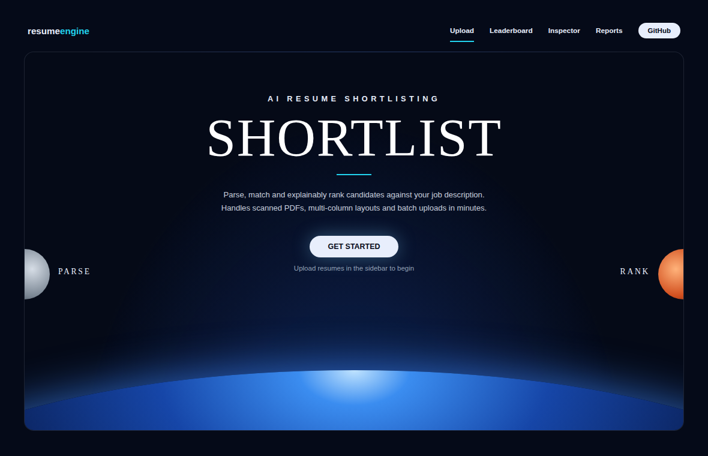

# AI Resume Shortlisting Engine

A multi-agent pipeline that parses resumes (including scanned PDFs), extracts structured data, matches skills against a job description, and produces an explainable, deterministic ranking. It ships with a CLI and a Streamlit dashboard.

> **Decision support, not decision making.** Scores are meant to help a human reviewer prioritise resumes. Always review shortlisted *and* rejected candidates manually.



## Features

- **Layout-aware PDF parsing**: splits multi-column templates by geometry (PyMuPDF) so sections don't interleave.
- **OCR fallback**: scanned resumes (under 50 extracted words) are rendered to images and read with EasyOCR, then Pytesseract.
- **Hybrid skill matching**: exact, synonym, fuzzy (RapidFuzz) and semantic (`all-MiniLM-L6-v2`) matching.
- **Grade normalisation**: CGPA, percentage and 4/5-point GPA converted to a 10-point scale. A missing grade is treated as *unknown* (0.0), never as a pass.
- **Deterministic scoring**: the same inputs always give the same score; the LLM is used only for extraction and explanations.
- **Explainable output**: three plain-language bullets per candidate, plus a per-component score breakdown.
- **Quality gate**: poor parses are flagged, capped at lower confidence, and never auto-shortlisted.

## Quick start

```bash
git clone https://github.com/Sinchanak-212/resume-shortlisting-engine.git
cd resume-shortlisting-engine
python -m venv .venv && source .venv/bin/activate      # Windows: .venv\Scripts\activate
pip install -r requirements.txt
python -m spacy download en_core_web_sm
cp .env.example .env                                    # then add at least one API key
```

Supported providers: Gemini, OpenAI, Anthropic (see `.env.example` for optional model overrides). Check each provider's current model list before overriding defaults.

### Dashboard

```bash
streamlit run app.py
```

Upload PDFs in the sidebar and click **Process & Rank**. Use the top navigation to switch between **Home**, **Leaderboard**, **Inspector** (per-candidate drill-down) and **Reports** (CSV / JSON / Markdown downloads).

### Command line

```bash
# One of the built-in roles: frontend, backend, fullstack, database, api_integration
python main.py --resumes_dir ./resumes --role_type backend

# Or your own job description
python main.py --resumes_dir ./resumes --jd_text_file ./jd.txt
```

Reports are written to `./reports/`: `[role]_report.csv`, `.json`, `.md`, and `[role]_parse_quality_report.csv`.

## How scoring works

| Component | Max points |
| --- | --- |
| Required skills | 45 (60 if the JD lists no preferred skills) |
| Preferred skills | 15 |
| Experience / internships | 10 |
| Projects | 10 |
| CGPA vs. JD minimum | 10 |
| Certifications | 5 |
| Education context | 5 |

Weights live in `config.py`. To score without any college-name bonus, set `ENABLE_COLLEGE_BONUS = False` there. A candidate is shortlisted only if they have a non-zero score **and** meet the JD's minimum CGPA; otherwise they go to the reserve list. See [`design_decisions.md`](design_decisions.md) for the parsing, OCR and confidence design.

## Tests

```bash
python tests/test_runner.py        # or: pytest tests/
```

The tests need only `pydantic`, `python-dotenv`, `rapidfuzz` and `pandas` (no models or API keys) and run in CI on every push.

## Privacy and responsible use

- Resume text is sent to the LLM provider you configure. Get candidate consent and follow your local data-protection rules before processing real resumes.
- Keyword and embedding matching can under-rate unconventional backgrounds. Treat scores as a starting point for review.

## Project layout

```
agents/   parser, OCR, extractor, skill extraction, matcher, scoring, confidence, ranker, explanation
models/   Pydantic schemas
utils/    LLM client, text helpers
app.py    Streamlit dashboard        main.py   CLI + pipeline orchestration
```

See [`ai_usage.md`](ai_usage.md) for how AI was used in building this project.
